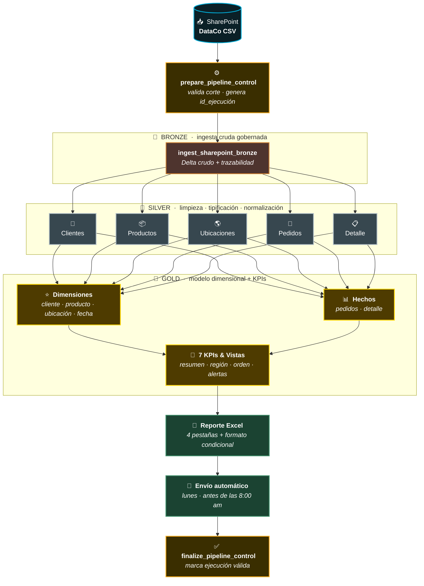
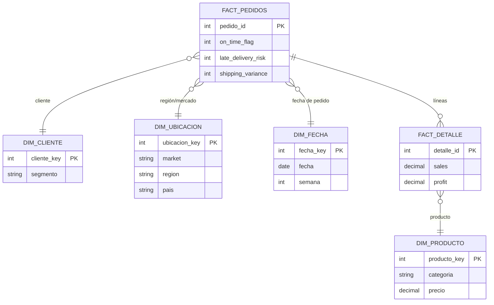
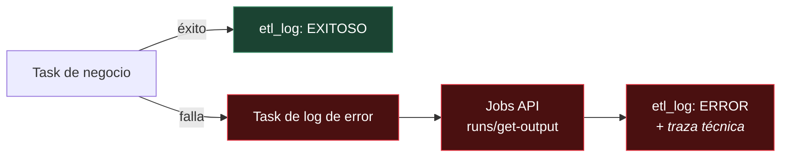

<div align="center">

# 🚚 Performance Logístico & Riesgo de Entrega
### Pipeline ELT · Arquitectura Data Lakehouse · Databricks

*Automatización end-to-end del reporte semanal de performance logístico y riesgo de entrega por región, migrando un proceso manual en Excel a un pipeline gobernado, idempotente y trazable sobre Unity Catalog.*

<br>


</div>

---

## 📌 Tabla de contenidos

- [Contexto del negocio](#-contexto-del-negocio)
- [Arquitectura de la solución](#-arquitectura-de-la-solución)
- [Tubería de datos de extremo a extremo](#-tubería-de-datos-de-extremo-a-extremo)
- [Las capas del Lakehouse](#-las-capas-del-lakehouse)
- [Modelo dimensional (Gold)](#-modelo-dimensional-gold)
- [Indicadores de negocio](#-indicadores-de-negocio)
- [Trazabilidad y manejo de errores](#-trazabilidad-y-manejo-de-errores)
- [Idempotencia y control de cortes](#-idempotencia-y-control-de-cortes)
- [Organización del repositorio](#-organización-del-repositorio)
- [Cómo ejecutar](#-cómo-ejecutar)
- [Stack técnico](#-stack-técnico)

---

## 🎯 Contexto del negocio

El área de Operaciones construía **manualmente en Excel** un reporte semanal de performance logístico, cruzando exports del ERP en un proceso que consumía **2–3 horas por analista** cada semana y generaba **cifras inconsistentes** entre áreas por trabajar con cortes distintos del mismo dato.

Este proyecto reemplaza ese proceso con un **pipeline ELT automatizado** que consolida la información con periodicidad semanal, permitiendo a Supply Chain y a las gerencias regionales tomar decisiones oportunas sobre priorización de envíos, selección de modos de transporte y gestión de reclamos por entregas tardías.

| Antes | Después |
|:---|:---|
| 2–3 horas semanales de trabajo manual | Ejecución automatizada y orquestada |
| Cifras distintas entre áreas | Una única fuente de verdad gobernada |
| Reacción a alertas en 48–72 h | Detección en la misma ejecución |
| Riesgo de error por copy/paste | Proceso idempotente y reproducible |

---

## 🏛 Arquitectura de la solución

La solución implementa una **arquitectura Data Lakehouse** con el patrón **Medallion (Bronze → Silver → Gold)** sobre **Databricks**, gobernada de extremo a extremo por **Unity Catalog** y ejecutada sobre **compute serverless**.

Toda la plataforma vive bajo un único catálogo de gobierno, `prod_dataco`, organizado por esquemas que representan cada capa y el dominio de control:

```
prod_dataco
├── brz_dataco     → Capa Bronze  (ingesta cruda en Delta)
├── slv_dataco     → Capa Silver  (limpieza, tipificación, normalización)
├── gld_dataco     → Capa Gold    (modelo dimensional + KPIs de negocio)
└── metadata       → Control del pipeline (etl_log, pipeline_control, ejecucion_control)
```

> **Principio rector:** los datos se enriquecen y ganan valor de negocio conforme ascienden de capa, mientras que la gobernanza, la trazabilidad y la calidad se aplican de forma consistente en todo el recorrido.

---

## 🔀 Tubería de datos de extremo a extremo

El dato fluye de arriba hacia abajo, ganando estructura y valor de negocio en cada capa — desde el archivo crudo en SharePoint hasta el reporte que llega al buzón del equipo de negocio.



<div align="center">

`SharePoint` → `Control` → 🥉 `Bronze` → 🥈 `Silver` → 🥇 `Gold` → 📗 `Excel` → 📧 `Correo`

</div>

Tras el cálculo de los KPIs, la capa Gold materializa un **reporte Excel de 4 pestañas** (Resumen Ejecutivo, Detalle Región, Detalle Orden y Alertas) con formato condicional, que se **distribuye automáticamente por correo** al grupo de negocio cada lunes antes de las 8:00 am.

Cada tarea del pipeline está acompañada de un **task dedicado de manejo de errores** que se dispara únicamente ante una falla, garantizando visibilidad granular por etapa (ver [Trazabilidad y manejo de errores](#-trazabilidad-y-manejo-de-errores)).

---

## 🧱 Las capas del Lakehouse

### 🥉 Bronze — Ingesta cruda gobernada

Extrae el dataset desde SharePoint (vía Microsoft Graph) correspondiente al corte validado, y lo persiste en **Delta** sin transformar, conservando la trazabilidad completa de la ejecución y del archivo de origen.

- Formato **Delta** desde el primer aterrizaje del dato.
- Metadatos de trazabilidad embebidos: `fecha_inicio_corte`, `fecha_fin_corte`, `fecha_carga`, `id_ejecucion`, `origen`, `archivo_origen`.
- **Control de duplicidad de corte:** si el corte ya existe, no se reinsertan registros.

### 🥈 Silver — Limpieza, tipificación y normalización

Descompone el dataset ancho de 53 columnas en **entidades independientes por dominio**, aplicando limpieza (`trim` + mayúsculas), tipificación de fechas y montos, y deduplicación por llave natural.

| Entidad | Grano | Estrategia de deduplicación |
|:---|:---|:---|
| **Clientes** | 1 registro por cliente | Una fila por cliente |
| **Productos** | 1 registro por producto | Una fila por producto |
| **Ubicaciones** | Combinación única de 6 columnas geográficas | Corte más reciente |
| **Pedidos** | 1 registro por pedido | Corte más reciente |
| **Detalle de Pedido** | 1 registro por línea de pedido | Corte más reciente |

> Silver mantiene la granularidad completa **sin agregaciones**. Los filtros de negocio específicos por indicador se aplican en Gold.

### 🥇 Gold — Modelo dimensional y KPIs de negocio

Consolida las entidades de Silver en un **modelo dimensional tipo estrella** y calcula los indicadores de negocio, materializando las vistas de consumo final.

**Vistas de salida:**

| Vista | Grano | Uso |
|:---|:---|:---|
| **Resumen Ejecutivo** | Por mercado (market) | KPIs totalizados + variación semanal |
| **Detalle Región** | Región + modo de envío | Los 7 indicadores desglosados |
| **Detalle Orden** | Máximo detalle | Análisis puntual y reclamos |
| **Alertas** | Órdenes de riesgo crítico | Riesgo tardío en regiones bajo umbral |

---

## ⭐ Modelo dimensional (Gold)



---

## 📊 Indicadores de negocio

Los **7 indicadores** replicados desde el proceso manual, con tolerancia de diferencia ≤ 0.5% por redondeos:

| # | Indicador | Granularidad |
|:---:|:---|:---|
| 1 | **On-Time Delivery %** | Región + modo de envío |
| 2 | **Late Delivery Risk %** | Región (con validación cruzada) |
| 3 | **Shipping Variance** | Promedio por región |
| 4 | **Profit Margin %** | Orden (resalta pérdidas) |
| 5 | **Revenue por Cliente** | Segmento de cliente |
| 6 | **Beneficio por Orden** | Orden |
| 7 | **Lead Time Promedio** | Modo de envío |

**Reglas de negocio aplicadas en Gold:**

- Agrupaciones regionales: `GLOBAL = LATAM + Europe + USCA + Pacific Asia + Africa` · `AMERICAS = LATAM + USCA`
- Se excluyen las órdenes canceladas del cálculo.
- Las órdenes sospechosas de fraude se incluyen pero se marcan.
- Los envíos cancelados se muestran en el detalle pero no entran a On-Time Delivery ni Lead Time.

---

## 🔎 Trazabilidad y manejo de errores

Cada etapa del pipeline registra su ciclo de vida en la tabla de control `metadata.etl_log`, siguiendo el flujo de estados:

```
EN_PROCESO  ──▶  EXITOSO
     │
     └────────▶  ERROR   (capturado por el task de error dedicado)
```

**Patrón de manejo de errores por etapa:** cada tarea de negocio tiene un **task de log de error asociado** que se ejecuta únicamente si la tarea principal falla. Este task:

1. Recupera el `log_id` de la ejecución fallida vía Task Values.
2. Consulta el detalle técnico de la excepción mediante la **Databricks Jobs API** (`runs/get-output`), usando *dynamic value references* (`run_id`, `error_code`, `result_state`).
3. Actualiza el registro en `etl_log` con estado `ERROR`, la marca de tiempo de finalización y la traza técnica del error.



Cada `id_ejecucion` identifica una corrida completa del workflow, mientras que cada `log_id` identifica la ejecución específica de un notebook — permitiendo trazabilidad **de extremo a extremo** y diagnóstico granular por etapa.

---

## 🔁 Idempotencia y control de cortes

El pipeline es **idempotente por diseño**: reejecutar el mismo corte produce un resultado idéntico, sin duplicar datos.

- **Bronze** valida la existencia del corte antes de escribir; si ya existe, no reinserta.
- **Silver** reconstruye cada tabla mediante `overwrite` completo desde el histórico acumulado de Bronze.
- **Control de ejecución** (`ejecucion_control`) marca una única ejecución como válida por corte, desmarcando las anteriores.

La tabla `pipeline_control` define el corte de extracción, y `prepare_pipeline_control` valida y publica los parámetros (`fecha_inicio`, `fecha_fin`, `id_ejecucion`) que consumen las etapas posteriores vía **Task Values**.

---

## 📁 Organización del repositorio

```
📦 performance-logistico-dataco
│
├── 📄 README.md
│
├── 📂 00_metadata/
│   ├── prepare_pipeline_control          # Corte, id_ejecución, publica parámetros
│   ├── log_error_prepare_pipeline_control
│   ├── finalize_pipeline_control         # Marca ejecución válida
│   └── log_error_finalize_pipeline_control
│
├── 📂 01_ingest/
│   ├── ingest_sharepoint_bronze          # SharePoint → Bronze (Delta)
│   └── log_error_ingest_sharepoint_bronze
│
├── 📂 02_silver/
│   ├── dimensiones/
│   │   ├── silver_clientes
│   │   ├── silver_productos
│   │   └── silver_ubicaciones
│   └── hechos/
│       ├── silver_pedidos
│       └── silver_pedido_detalle
│
└── 📂 03_gold/
    ├── dimensiones/
    ├── hechos/
    └── kpis/                             # Vistas de consumo + alertas
```

---

## ▶️ Cómo ejecutar

El pipeline se orquesta como un **Databricks Job (Lakeflow)** sobre compute serverless. El orden de ejecución es gestionado por el DAG de tareas:

1. **`prepare_pipeline_control`** — valida el corte y publica parámetros.
2. **`ingest_sharepoint_bronze`** — ingesta cruda a Bronze.
3. **Capa Silver** — las 5 entidades se procesan en paralelo.
4. **Capa Gold** — dimensiones, hechos y KPIs.
5. **`finalize_pipeline_control`** — marca la ejecución como válida.

> Cada tarea de negocio tiene su task de error configurado con la condición *"if at least one failed"*, alimentado con los parámetros dinámicos `run_id`, `error_code` y `result_state` desde el workflow.

**Parámetros de configuración (Task Parameters):**

| Parámetro | Valor |
|:---|:---|
| `bronze_catalog` / `silver_catalog` | `prod_dataco` |
| `bronze_schema` | `brz_dataco` |
| `silver_schema` | `slv_dataco` |
| `bronze_table` | `raw_dataco_supply_chain` |

---

## 🛠 Stack técnico

<div align="center">

| Categoría | Tecnología |
|:---|:---|
| **Plataforma** | Databricks |
| **Almacenamiento** | Delta Lake |
| **Gobernanza** | Unity Catalog |
| **Procesamiento** | PySpark |
| **Orquestación** | Databricks Workflows / Lakeflow Jobs |
| **Compute** | Serverless |
| **Origen** | SharePoint (Microsoft Graph API) |
| **Patrón arquitectónico** | Medallion (Bronze · Silver · Gold) |

</div>

---

<div align="center">

**Arquitectura Data Lakehouse · Bronze → Silver → Gold · gobernada, idempotente y trazable de extremo a extremo.**

</div>
