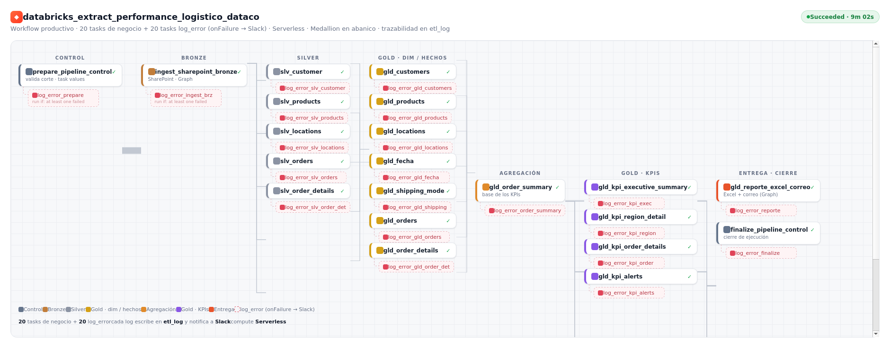

<div align="center">

# 🏗️ DataCo Supply Chain · Data Lakehouse

### Plataforma de datos **ELT end-to-end** sobre Databricks Lakehouse — de SSIS on-premise a un Lakehouse cloud gobernado, con observabilidad, calidad y Machine Learning

De SharePoint al correo del área de negocio: ingesta, modelo dimensional con historial, observabilidad y un reporte ejecutivo que se envía solo.

<br>


</div>

---

## 🎯 En una línea

Tomé un reporte logístico que se armaba a mano cada semana cruzando exports en Excel (2–3 horas de un analista) y lo convertí en un **pipeline automático de punta a punta** sobre Databricks Lakehouse: toma los datos de SharePoint, los procesa en capas, calcula 7 indicadores de negocio y envía un Excel ejecutivo por correo, con trazabilidad y alertas en cada paso.

## ⭐ Lo que resuelve

- **Antes:** proceso manual, lento y con cifras distintas entre áreas según el corte.
- **Ahora:** una sola corrida reproducible, con reglas de negocio centralizadas, historial de cambios y entrega automática al área.

---

## 🧭 Pipeline de un vistazo

```
SharePoint ──▶ 🥉 Bronze ──▶ 🥈 Silver ──▶ 🥇 Gold ──▶ 📊 Excel + 📧 Correo
             (ingesta       (tipado,       (modelo       (reporte ejecutivo
              por corte)     dedupe)        estrella +     automático)
                                            KPIs)
                    └──── 📋 etl_log + 🚨 alertas Slack en cada task ────┘
```

| | |
|---|---|
| **Fuente** | Archivo en SharePoint Online, descargado vía Microsoft Graph |
| **Procesamiento** | PySpark + Spark SQL sobre Delta Lake |
| **Arquitectura** | Medallion: Bronze → Silver → Gold |
| **Orquestación** | Databricks Workflow (20 tasks, compute Serverless) |
| **Modelo** | Esquema estrella con **SCD2** en dimensiones y hechos clave |
| **Observabilidad** | Tabla `etl_log` + alerta a Slack ante cualquier fallo |
| **Entrega** | Excel de 4 pestañas enviado por correo (Microsoft Graph) |

---

## 🔧 Qué hace cada capa

### 🥉 Bronze — ingesta cruda
Descarga el archivo desde SharePoint y carga **solo el corte de fechas** definido en una tabla de control. Cada corte se agrega sin tocar los anteriores y el proceso es idempotente: volver a correrlo no duplica datos.

### 🥈 Silver — datos limpios y conformados
Tipado fuerte, normalización y deduplicación por llave de negocio. Separa el archivo de origen en entidades: clientes, productos, ubicaciones, pedidos y detalle de pedido.

### 🥇 Gold — modelo dimensional y KPIs
Esquema estrella listo para análisis:
- **5 dimensiones** (clientes y productos con historial SCD2; ubicaciones, fecha y modo de envío).
- **2 tablas de hechos** (pedidos con SCD2 y reglas de negocio; detalle de pedido).
- **Resumen por pedido** como base única de los indicadores.
- **4 vistas de KPIs:** Resumen Ejecutivo, Detalle por Región, Detalle por Orden (SCD2) y Alertas.

### 📊 Entrega a negocio
Un notebook genera el **Excel de 4 pestañas** con formato condicional tipo semáforo y lo **envía por correo** con una tabla resumen y un gráfico en el cuerpo del mensaje.

---

## 📐 Los 7 indicadores

On-Time Delivery % · Late Delivery Risk % · Shipping Variance · Profit Margin % · Revenue por Cliente · Beneficio por Orden · Lead Time Promedio

Con agrupaciones de negocio **GLOBAL** (todos los mercados) y **AMERICAS** (LATAM + USCA), y reglas de alcance: se excluyen los pedidos cancelados y se marcan los sospechosos de fraude.

---

## 🛡️ Confiabilidad y trazabilidad

- **Tabla `etl_log`:** cada notebook registra inicio, fin, filas procesadas y estado (`EN_PROCESO → EXITOSO / ERROR`), con un identificador único por ejecución del Workflow.
- **Manejo de errores:** cada task de negocio tiene su task de log que, ante un fallo, registra el detalle técnico de la excepción y **avisa a Slack**.
- **Control de corte:** una tabla de parámetros define la ventana a procesar; el reproceso del mismo corte es idempotente.

---

## 🗂️ Modelo dimensional

```
        dim_customers        dim_products
              │                    │
              ▼                    ▼
  dim_fecha ─▶ fact_orders ◀─ fact_order_details ◀─ dim_products
              ▲       ▲
        dim_locations  dim_shipping_mode
```

Las dimensiones de clientes y productos y la tabla de hechos de pedidos usan **SCD2**: conservan el historial, de modo que cada pedido puede analizarse con los atributos vigentes en su momento.

---

## 🔄 Tubería de datos de punta a punta

Pipeline orquestado como un único **Databricks Workflow en abanico**: las capas sin dependencia entre sí se ejecutan en paralelo. Son **20 tasks de negocio**, y **cada una tiene su task `log_error`** que, ante un fallo, registra la excepción en `etl_log` y notifica a **Slack**. Así se ve la tubería completa, de la ingesta en SharePoint hasta el envío del Excel por correo:

<p align="center">
  
</p>

**Recorrido de una ejecución**

```
prepare_pipeline_control
      │
      ▼
ingest_sharepoint_bronze                      (SharePoint → Bronze, por corte)
      │
      ├─▶ slv_customer · slv_products · slv_locations · slv_orders · slv_order_details
      │
      ├─▶ gld_customers · gld_products · gld_locations · gld_fecha · gld_shipping_mode
      │        gld_orders · gld_order_details
      │
      ▼
gld_order_summary                             (base única de los KPIs)
      │
      ├─▶ gld_kpi_executive_summary · gld_kpi_region_detail
      │        gld_kpi_order_details · gld_kpi_alerts
      │
      ▼
gld_reporte_excel_correo                      (Excel de 4 pestañas + correo vía Graph)
      │
      ▼
finalize_pipeline_control                     (cierre de la ejecución)
```

Cada task de negocio (azul/dorado/violeta) tiene colgando su task `log_error` (línea punteada roja): se dispara solo si la task falla, deja el detalle técnico en `etl_log` y envía la alerta a Slack. La trazabilidad es de punta a punta, task por task.

---

## 🛠️ Stack

| Área | Tecnología |
|---|---|
| Plataforma | Databricks (Free Edition) · Serverless |
| Procesamiento | PySpark · Spark SQL |
| Almacenamiento | Delta Lake |
| Catálogo | Unity Catalog |
| Ingesta y correo | Microsoft Graph API |
| Secretos | Databricks Secret Scopes |
| Alertas | Webhook de Slack |
| Reportería | openpyxl · matplotlib |

---

## 📁 Organización del repositorio

```
00_metadata/                  # control del pipeline (prepare / finalize) + logs
01_ingest_sharepoint_bronze/  # ingesta a Bronze + logs
02_silver_dimensiones/        # clientes, productos, ubicaciones + logs
02_silver_hechos/             # pedidos, detalle de pedido + logs
03_gold_dimensiones/          # 5 dimensiones + logs
03_gold_hechos/               # pedidos, detalle de pedido + logs
03_gold_kpis/                 # resumen por pedido, 4 KPIs, reporte + logs
```

Cada carpeta separa el notebook de negocio (`01_negocio/`) de su notebook de manejo de errores (`02_logs/`).

---

## 🔄 Workflow

Orquestado como un único Databricks Workflow de 20 tasks de negocio, cada una con su task de log de error. El grafo final corre en **abanico**: las capas que no dependen entre sí se ejecutan en paralelo.

```
prepare ─▶ ingest ─▶ ┌ 5 Silver ┐ ─▶ ┌ 7 Gold dim/hechos ┐ ─▶ order_summary ─▶ ┌ 4 KPIs ┐ ─▶ reporte ─▶ finalize
```

---

## 🧩 Contexto del proyecto

Proyecto de portafolio que **migra un proceso tradicional** (SQL Server Integration Services sobre Data Warehouse on-premise) a una **arquitectura Lakehouse en la nube**, conservando las reglas de negocio del reporte original. El dataset es público (*DataCo Smart Supply Chain*, Kaggle) y la infraestructura es real.

---

## 🚀 Capacidades de nivel productivo

Más allá del pipeline base, el proyecto incorpora una capa completa de gobierno, calidad, automatización y analítica avanzada:

### 🛡️ Gobierno de datos (Unity Catalog)
Etiquetas de propiedad por tabla, enmascaramiento dinámico de datos sensibles (como el correo del cliente) y filtros a nivel de fila según el grupo del usuario, todo gestionado en Unity Catalog.

### ✅ Calidad de datos declarativa
Motor de calidad basado en una tabla de reglas y una tabla de resultados: cada corrida valida las reglas aplicables y persiste el resultado, con constraints a nivel Delta que protegen la integridad de las tablas.

### 📈 Dashboard de salud del pipeline
Tablero de Databricks SQL sobre `etl_log` con la tasa de éxito por día, la duración promedio por task, la volumetría por capa y los últimos errores.

### ⚙️ Infraestructura como código y CI/CD
Todo el entorno descrito con Databricks Asset Bundles y desplegado con GitHub Actions (lint, validación y despliegue), con separación de ambientes dev y prod.

### 🔄 Ingesta incremental
Ingesta con Auto Loader para el procesamiento incremental de archivos a medida que llegan al almacenamiento de objetos.

### 🤖 Capa de Machine Learning
La capa Gold alimenta un modelo predictivo que anticipa el riesgo de retraso en los envíos, integrando el Lakehouse con el ciclo de MLOps.

---

<div align="center">

**Josuhe Sosa Lara** · Data Engineering · Lima, Perú

*Dataset público · infraestructura real · construido de punta a punta sobre Databricks Lakehouse.*

</div>
