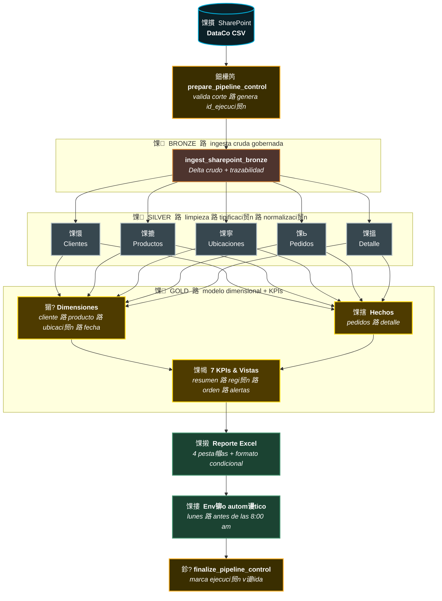
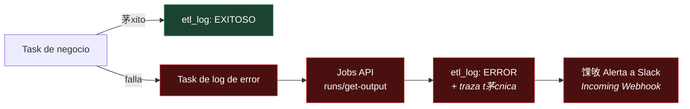

<div align="center">

# 馃殮 Performance Log铆stico & Riesgo de Entrega
### Pipeline ELT 路 Arquitectura Data Lakehouse 路 Databricks

*Automatizaci贸n end-to-end del reporte semanal de performance log铆stico y riesgo de entrega por regi贸n, migrando un proceso manual en Excel a un pipeline gobernado, idempotente y trazable sobre Unity Catalog.*

<br>


</div>

---

## 馃搶 Tabla de contenidos

- [Contexto del negocio](#-contexto-del-negocio)
- [Arquitectura de la soluci贸n](#-arquitectura-de-la-soluci贸n)
- [Tuber铆a de datos de extremo a extremo](#-tuber铆a-de-datos-de-extremo-a-extremo)
- [Las capas del Lakehouse](#-las-capas-del-lakehouse)
- [Modelo dimensional (Gold)](#-modelo-dimensional-gold)
- [Indicadores de negocio](#-indicadores-de-negocio)
- [Trazabilidad y manejo de errores](#-trazabilidad-y-manejo-de-errores)
- [Idempotencia y control de cortes](#-idempotencia-y-control-de-cortes)
- [Organizaci贸n del repositorio](#-organizaci贸n-del-repositorio)
- [C贸mo ejecutar](#-c贸mo-ejecutar)
- [Stack t茅cnico](#-stack-t茅cnico)

---

## 馃幆 Contexto del negocio

El 谩rea de Operaciones constru铆a **manualmente en Excel** un reporte semanal de performance log铆stico, cruzando exports del ERP en un proceso que consum铆a **2鈥? horas por analista** cada semana y generaba **cifras inconsistentes** entre 谩reas por trabajar con cortes distintos del mismo dato.

Este proyecto reemplaza ese proceso con un **pipeline ELT automatizado** que consolida la informaci贸n con periodicidad semanal, permitiendo a Supply Chain y a las gerencias regionales tomar decisiones oportunas sobre priorizaci贸n de env铆os, selecci贸n de modos de transporte y gesti贸n de reclamos por entregas tard铆as.

| Antes | Despu茅s |
|:---|:---|
| 2鈥? horas semanales de trabajo manual | Ejecuci贸n automatizada y orquestada |
| Cifras distintas entre 谩reas | Una 煤nica fuente de verdad gobernada |
| Reacci贸n a alertas en 48鈥?2 h | Detecci贸n en la misma ejecuci贸n |
| Riesgo de error por copy/paste | Proceso idempotente y reproducible |

---

## 馃彌 Arquitectura de la soluci贸n

La soluci贸n implementa una **arquitectura Data Lakehouse** con el patr贸n **Medallion (Bronze 鈫?Silver 鈫?Gold)** sobre **Databricks**, gobernada de extremo a extremo por **Unity Catalog** y ejecutada sobre **compute serverless**.

Toda la plataforma vive bajo un 煤nico cat谩logo de gobierno, `prod_dataco`, organizado por esquemas que representan cada capa y el dominio de control:

```
prod_dataco
鈹溾攢鈹€ brz_dataco     鈫?Capa Bronze  (ingesta cruda en Delta)
鈹溾攢鈹€ slv_dataco     鈫?Capa Silver  (limpieza, tipificaci贸n, normalizaci贸n)
鈹溾攢鈹€ gld_dataco     鈫?Capa Gold    (modelo dimensional + KPIs de negocio)
鈹斺攢鈹€ metadata       鈫?Control del pipeline (etl_log, pipeline_control, ejecucion_control)
```

> **Principio rector:** los datos se enriquecen y ganan valor de negocio conforme ascienden de capa, mientras que la gobernanza, la trazabilidad y la calidad se aplican de forma consistente en todo el recorrido.

---

## 馃攢 Tuber铆a de datos de extremo a extremo

El dato fluye de arriba hacia abajo, ganando estructura y valor de negocio en cada capa 鈥?desde el archivo crudo en SharePoint hasta el reporte que llega al buz贸n del equipo de negocio.



<div align="center">

`SharePoint` 鈫?`Control` 鈫?馃 `Bronze` 鈫?馃 `Silver` 鈫?馃 `Gold` 鈫?馃摋 `Excel` 鈫?馃摟 `Correo`

</div>

Tras el c谩lculo de los KPIs, la capa Gold materializa un **reporte Excel de 4 pesta帽as** (Resumen Ejecutivo, Detalle Regi贸n, Detalle Orden y Alertas) con formato condicional, que se **distribuye autom谩ticamente por correo** al grupo de negocio cada lunes antes de las 8:00 am.

Cada tarea del pipeline est谩 acompa帽ada de un **task dedicado de manejo de errores** que se dispara 煤nicamente ante una falla, garantizando visibilidad granular por etapa (ver [Trazabilidad y manejo de errores](#-trazabilidad-y-manejo-de-errores)).

---

## 馃П Las capas del Lakehouse

### 馃 Bronze 鈥?Ingesta cruda gobernada

Extrae el dataset desde SharePoint (v铆a Microsoft Graph) correspondiente al corte validado, y lo persiste en **Delta** sin transformar, conservando la trazabilidad completa de la ejecuci贸n y del archivo de origen.

- Formato **Delta** desde el primer aterrizaje del dato.
- Metadatos de trazabilidad embebidos: `fecha_inicio_corte`, `fecha_fin_corte`, `fecha_carga`, `id_ejecucion`, `origen`, `archivo_origen`.
- **Control de duplicidad de corte:** si el corte ya existe, no se reinsertan registros.

### 馃 Silver 鈥?Limpieza, tipificaci贸n y normalizaci贸n

Descompone el dataset ancho de 53 columnas en **entidades independientes por dominio**, aplicando limpieza (`trim` + may煤sculas), tipificaci贸n de fechas y montos, y deduplicaci贸n por llave natural.

| Entidad | Grano | Estrategia de deduplicaci贸n |
|:---|:---|:---|
| **Clientes** | 1 registro por cliente | Una fila por cliente |
| **Productos** | 1 registro por producto | Una fila por producto |
| **Ubicaciones** | Combinaci贸n 煤nica de 6 columnas geogr谩ficas | Corte m谩s reciente |
| **Pedidos** | 1 registro por pedido | Corte m谩s reciente |
| **Detalle de Pedido** | 1 registro por l铆nea de pedido | Corte m谩s reciente |

> Silver mantiene la granularidad completa **sin agregaciones**. Los filtros de negocio espec铆ficos por indicador se aplican en Gold.

### 馃 Gold 鈥?Modelo dimensional y KPIs de negocio

Consolida las entidades de Silver en un **modelo dimensional tipo estrella** y calcula los indicadores de negocio, materializando las vistas de consumo final.

**Vistas de salida:**

| Vista | Grano | Uso |
|:---|:---|:---|
| **Resumen Ejecutivo** | Por mercado (market) | KPIs totalizados + variaci贸n semanal |
| **Detalle Regi贸n** | Regi贸n + modo de env铆o | Los 7 indicadores desglosados |
| **Detalle Orden** | M谩ximo detalle | An谩lisis puntual y reclamos |
| **Alertas** | 脫rdenes de riesgo cr铆tico | Riesgo tard铆o en regiones bajo umbral |

---

## 猸?Modelo dimensional (Gold)


---

## 馃搳 Indicadores de negocio

Los **7 indicadores** replicados desde el proceso manual, con tolerancia de diferencia 鈮?0.5% por redondeos:

| # | Indicador | Granularidad |
|:---:|:---|:---|
| 1 | **On-Time Delivery %** | Regi贸n + modo de env铆o |
| 2 | **Late Delivery Risk %** | Regi贸n (con validaci贸n cruzada) |
| 3 | **Shipping Variance** | Promedio por regi贸n |
| 4 | **Profit Margin %** | Orden (resalta p茅rdidas) |
| 5 | **Revenue por Cliente** | Segmento de cliente |
| 6 | **Beneficio por Orden** | Orden |
| 7 | **Lead Time Promedio** | Modo de env铆o |

**Reglas de negocio aplicadas en Gold:**

- Agrupaciones regionales: `GLOBAL = LATAM + Europe + USCA + Pacific Asia + Africa` 路 `AMERICAS = LATAM + USCA`
- Se excluyen las 贸rdenes canceladas del c谩lculo.
- Las 贸rdenes sospechosas de fraude se incluyen pero se marcan.
- Los env铆os cancelados se muestran en el detalle pero no entran a On-Time Delivery ni Lead Time.

---

## 馃攷 Trazabilidad y manejo de errores

Cada etapa del pipeline registra su ciclo de vida en la tabla de control `metadata.etl_log`, siguiendo el flujo de estados:

```
EN_PROCESO  鈹€鈹€鈻? EXITOSO
     鈹?     鈹斺攢鈹€鈹€鈹€鈹€鈹€鈹€鈹€鈻? ERROR   (capturado por el task de error dedicado)
```

**Patr贸n de manejo de errores por etapa:** cada tarea del pipeline (control, ingesta y las 5 tablas Silver) tiene un **task de log de error asociado** que se ejecuta 煤nicamente si la tarea principal falla. Este task:

1. Recupera el `log_id` de la ejecuci贸n fallida v铆a Task Values.
2. Consulta el detalle t茅cnico de la excepci贸n mediante la **Databricks Jobs API** (`runs/get-output`), usando *dynamic value references* (`run_id`, `error_code`, `result_state`).
3. Actualiza el registro en `etl_log` con estado `ERROR`, la marca de tiempo de finalizaci贸n y la traza t茅cnica del error.
4. Env铆a una **alerta en tiempo real a Slack** v铆a Incoming Webhook, con el detalle del task, el `run_id` y el `log_id` 鈥?sin exponer la URL del webhook en el c贸digo (se lee de un secret scope de Databricks). *Implementado en los 5 notebooks de error de Silver; pendiente de replicar en los 3 de control (`prepare`/`ingest`/`finalize`).*



Cada `id_ejecucion` identifica una corrida completa del workflow, mientras que cada `log_id` identifica la ejecuci贸n espec铆fica de un notebook 鈥?permitiendo trazabilidad **de extremo a extremo** y diagn贸stico granular por etapa.

---

## 馃攣 Idempotencia y control de cortes

El pipeline es **idempotente por dise帽o**: reejecutar el mismo corte produce un resultado id茅ntico, sin duplicar datos.

- **Bronze** valida la existencia del corte antes de escribir; si ya existe, no reinserta.
- **Silver** reconstruye cada tabla mediante `overwrite` completo desde el hist贸rico acumulado de Bronze.
- **Control de ejecuci贸n** (`ejecucion_control`) marca una 煤nica ejecuci贸n como v谩lida por corte, desmarcando las anteriores.

La tabla `pipeline_control` define el corte de extracci贸n, y `prepare_pipeline_control` valida y publica los par谩metros (`fecha_inicio`, `fecha_fin`, `id_ejecucion`) que consumen las etapas posteriores v铆a **Task Values**.

---

## 馃搧 Organizaci贸n del repositorio

```
馃摝 performance-logistico-dataco
鈹?鈹溾攢鈹€ 馃搫 README.md
鈹?鈹溾攢鈹€ 馃搨 00_metadata/
鈹?  鈹溾攢鈹€ 01_control_pipeline/
鈹?  鈹?  鈹溾攢鈹€ prepare_pipeline_control       # Corte, id_ejecuci贸n, publica par谩metros
鈹?  鈹?  鈹斺攢鈹€ finalize_pipeline_control      # Marca ejecuci贸n v谩lida
鈹?  鈹斺攢鈹€ 02_logs/
鈹?      鈹溾攢鈹€ log_error_prepare_pipeline_control
鈹?      鈹斺攢鈹€ log_error_finalize_pipeline_control
鈹?鈹溾攢鈹€ 馃搨 01_ingest_sharepoint_bronze/
鈹?  鈹溾攢鈹€ 01_ingest/
鈹?  鈹?  鈹斺攢鈹€ ingest_sharepoint_bronze       # SharePoint 鈫?Bronze (Delta)
鈹?  鈹斺攢鈹€ 02_logs/
鈹?      鈹斺攢鈹€ log_error_ingest_sharepoint_bronze
鈹?鈹溾攢鈹€ 馃搨 02_silver_dimensiones/
鈹?  鈹溾攢鈹€ 01_negocio/
鈹?  鈹?  鈹溾攢鈹€ slv_customer
鈹?  鈹?  鈹溾攢鈹€ slv_products
鈹?  鈹?  鈹斺攢鈹€ slv_locations
鈹?  鈹斺攢鈹€ 02_logs/
鈹?      鈹溾攢鈹€ log_error_slv_customer
鈹?      鈹溾攢鈹€ log_error_slv_products
鈹?      鈹斺攢鈹€ log_error_slv_locations
鈹?鈹溾攢鈹€ 馃搨 02_silver_hechos/
鈹?  鈹溾攢鈹€ 01_negocio/
鈹?  鈹?  鈹溾攢鈹€ slv_orders
鈹?  鈹?  鈹斺攢鈹€ slv_order_details
鈹?  鈹斺攢鈹€ 02_logs/
鈹?      鈹溾攢鈹€ log_error_slv_orders
鈹?      鈹斺攢鈹€ log_error_slv_order_details
鈹?鈹斺攢鈹€ 馃搨 03_gold_kpis/
```

---

## 鈻讹笍 C贸mo ejecutar

El pipeline se orquesta como un **Databricks Job (Lakeflow)** sobre compute serverless. El orden de ejecuci贸n es gestionado por el DAG de tareas:

1. **`prepare_pipeline_control`** 鈥?valida el corte y publica par谩metros.
2. **`ingest_sharepoint_bronze`** 鈥?ingesta cruda a Bronze.
3. **Capa Silver** 鈥?las 5 entidades se procesan en paralelo.
4. **Capa Gold** 鈥?dimensiones, hechos y KPIs.
5. **`finalize_pipeline_control`** 鈥?marca la ejecuci贸n como v谩lida.

> Cada tarea de negocio tiene su task de error configurado con la condici贸n *"if at least one failed"*, alimentado con los par谩metros din谩micos `run_id`, `error_code` y `result_state` desde el workflow.

**Par谩metros de configuraci贸n (Task Parameters):**

| Par谩metro | Valor |
|:---|:---|
| `bronze_catalog` / `silver_catalog` | `prod_dataco` |
| `bronze_schema` | `brz_dataco` |
| `silver_schema` | `slv_dataco` |
| `bronze_table` | `raw_dataco_supply_chain` |

---

## 馃洜 Stack t茅cnico

<div align="center">

| Categor铆a | Tecnolog铆a |
|:---|:---|
| **Plataforma** | Databricks |
| **Almacenamiento** | Delta Lake |
| **Gobernanza** | Unity Catalog |
| **Procesamiento** | PySpark |
| **Orquestaci贸n** | Databricks Workflows / Lakeflow Jobs |
| **Compute** | Serverless |
| **Origen** | SharePoint (Microsoft Graph API) |
| **Patr贸n arquitect贸nico** | Medallion (Bronze 路 Silver 路 Gold) |

</div>

---

<div align="center">

**Arquitectura Data Lakehouse 路 Bronze 鈫?Silver 鈫?Gold 路 gobernada, idempotente y trazable de extremo a extremo.**

</div>
